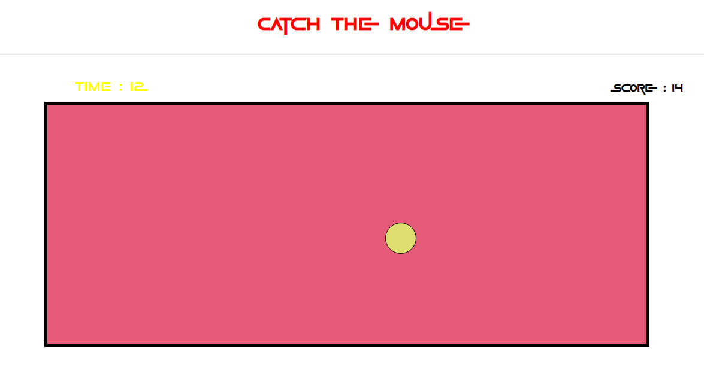

# 🎯 Catch the Mouse Game

A simple click-based game built using HTML, CSS, and JavaScript where the player clicks a moving target to score points within a limited time.

## 🚀 Live Demo
🔗 https://lukman2458.github.io/js-catch-the-mouse-game/

## 📸 Preview

## 🛠️ Features
- Click-based interactive gameplay
- Moving target with random positions
- Timer-based scoring system
- Real-time Score tracking

## 📚 What I Learned
- Implementing timers using JavaScript
- Generating random positions dynamically
- Handling user click events
- Improving UI with custom fonts
